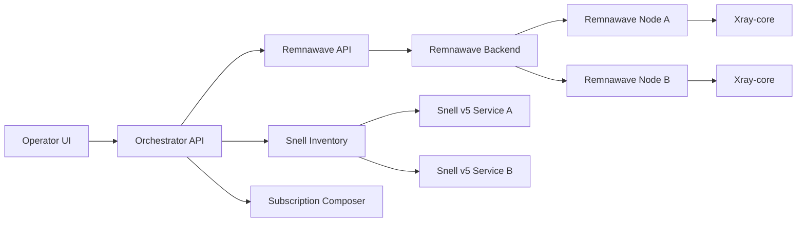

# Remnawave Orchestrator Plan

## Purpose

Build a beginner-friendly orchestration layer on top of Remnawave:

- Keep Remnawave managing Xray nodes and Xray configuration delivery.
- Keep Snell v5 outside Remnawave Node as an independent Docker/systemd service.
- Provide a simple UI that turns advanced Xray routing into safe presets and buttons.
- Generate and push Remnawave Config Profiles instead of asking beginners to hand-write Xray JSON.
- Optionally merge Snell entries into client subscriptions for clients that support Snell.

This plan intentionally avoids making Snell a native Remnawave Node protocol in the first phase.

## Repository Reality

The `remnawave/panel` repository is the documentation site (`@remnawave/docs`) built with Docusaurus.

Runtime implementation will likely need one of these paths:

1. Companion orchestrator repository, recommended first.
2. Direct Remnawave integration across `remnawave/frontend` and `remnawave/backend`.
3. Deep node integration involving `remnawave/node`, not recommended for the first Snell phase.

## Target Architecture

## Functional Categories

### 1. Server Inventory

Track servers independently from Remnawave's own node model.

Fields:

- name
- provider
- region
- IPv4 address
- IPv6 address
- SSH connection profile, optional and encrypted
- role: panel, xray-node, snell-node, exit-node, mixed
- tags

### 2. Xray Node Orchestration

Use Remnawave as the source of truth for Xray nodes.

UI actions:

- Add Remnawave Node.
- Attach a server record.
- Select active Config Profile.
- Select visible inbounds.
- Apply preset routing.
- Force restart selected nodes after profile changes.

Generated Remnawave objects:

- Config Profiles
- Hosts
- Internal Squads
- Optional service users for bridge routing

### 3. Snell External Node Management

Snell v5 is managed as an external service.

Phase 1:

- Record external Snell nodes.
- Store host, port, PSK/password, version, obfuscation options if used.
- Generate Docker/systemd snippets.
- Compose subscription entries for compatible clients.

Phase 2:

- Optional remote deployment through SSH.
- Optional status checks.
- Optional traffic collection through host-level metrics, not Remnawave Xray metrics.

### 4. Route Presets

Expose advanced Xray routing as presets.

Starter presets:

- Default IPv6 exit.
- Default IPv4 exit.
- AI traffic to selected exit node.
- Domestic/private traffic direct or block.
- BitTorrent block.
- Selected domains to selected outbound.
- Selected IP CIDR to selected outbound.

Preset UI should not expose raw JSON by default. Advanced users can inspect and edit generated JSON.

### 5. Bridge Builder

Build multi-node Xray routing without forcing users to write bridge configs.

Example:

- Entry node: A
- Exit node: B
- Transit protocol: Shadowsocks or VLESS
- AI rules: send to B IPv6 exit
- Default traffic: A IPv6 exit
- Optional fallback: A IPv4 exit

Generated config:

- B node bridge inbound
- A node outbound pointing to B
- A node routing rules
- service user credentials if required

### 6. Rule Packs

Maintain named rule packs that expand into Xray routing rules.

Initial packs:

- AI: OpenAI, Anthropic, Gemini, Copilot, Perplexity, Poe
- Search
- Streaming
- Telegram
- Private networks
- BitTorrent

Each pack records:

- domains
- geosite categories when available
- IP ranges when needed
- default outbound behavior
- last reviewed date

### 7. Subscription Composer

Create client-aware subscriptions:

- Remnawave subscription URL remains the normal Xray path.
- Orchestrator may add a composed subscription URL for clients that support mixed entries.
- Snell entries are included only for compatible clients.

Important limitation:

- Snell is mainly useful for clients such as Surge and other Snell-compatible clients.
- Do not advertise Snell entries to clients that cannot import them cleanly.

## MVP Scope

MVP should be a companion app, not a Remnawave fork.

MVP includes:

1. Connect to Remnawave API with an API token.
2. Read nodes, config profiles, hosts, squads, and users as needed.
3. Store external server and Snell inventory locally.
4. Provide a visual route wizard.
5. Generate Xray Config Profiles.
6. Push generated profiles to Remnawave.
7. Generate Snell config snippets.
8. Generate a composed subscription preview.

MVP excludes:

- Native Snell traffic accounting inside Remnawave.
- Native Snell protocol support inside Remnawave Node.
- Automatic SSH deployment by default.
- Billing and payment logic.

## Implementation Choices

Recommended stack for companion MVP:

- Frontend: Next.js or Vite + React.
- Backend: NestJS/Fastify or a small Go service.
- Database: SQLite for MVP, PostgreSQL later.
- API integration: Remnawave OpenAPI or `@remnawave/backend-contract` where practical.
- Config generation: typed templates plus JSON schema validation.

## Safety Rules

- Never overwrite manually created Config Profiles unless they are marked as orchestrator-managed.
- Keep all generated objects tagged with a stable prefix, for example `orchestrator:`.
- Always show a diff before pushing generated Xray JSON.
- Validate Xray JSON before applying.
- Keep Snell credentials encrypted at rest.
- Do not expose Remnawave Node management ports to the public internet.

## Future Direct Integration

If the companion app proves useful, direct integration can be considered:

- `remnawave/frontend`: add route wizard UI.
- `remnawave/backend`: add orchestrator-owned presets, generated profile APIs, and Snell inventory APIs.
- `remnawave/node`: only needed if Snell becomes native, which is intentionally out of MVP scope.

Direct integration should happen after the config generator and UX are stable.
